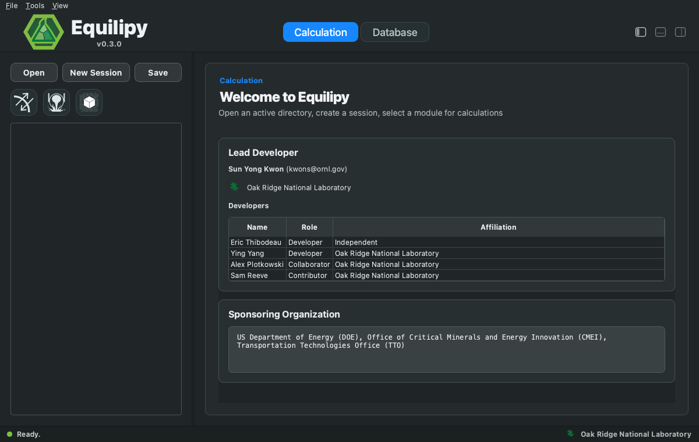

[](https://pypi.org/project/equilipy/)
[](https://pypistats.org/packages/equilipy)
[](https://doi.org/10.21105/joss.06875)
[](https://doi.org/10.5281/zenodo.13157235)

# Equilipy
Equilipy is an open-source Python package for multicomponent-multiphase
equilibrium calculations based on the [CALPHAD](https://calphad.org)
(CALculation of PHAse Diagram) approach. Given a thermochemical database and
input conditions (composition, pressure, and temperature), it computes the
equilibrium phase configuration, amounts, compositions, and thermochemical
properties. Equilipy uses the Gibbs energy descriptions furnished by
[THERMOCHIMICA](https://github.com/ORNL-CEES/thermochimica) with the modified
Gibbs energy minimization algorithm inspired by Eriksson (1971) and
de Capitani and Brown (1987). Check out the
[documentation](https://ornl.github.io/Equilipy/) for further description.

## Requirements

Equilipy supports Python 3.10-3.14 on Linux, Windows, and macOS. A Fortran
compiler is needed only when
[building from source](https://ornl.github.io/Equilipy/install.html).

## Installation
### Python package
Core package:
```
pip install equilipy
```

Desktop GUI (adds the `equilipy.gui` command):
```
pip install "equilipy[gui]"
```

MPI helpers for multi-node clusters:
```
pip install "equilipy[hpc]"
```
### Graphical User Interface (GUI)
For standalone GUI installation, download the installer that matches your system:
- macOS Apple Silicon, macOS 15: [Equilipy-macos-15-arm64.dmg](https://github.com/ORNL/Equilipy/releases/latest/download/Equilipy-macos-15-arm64.dmg)
- macOS Apple Silicon, macOS 14: [Equilipy-macos-14-arm64.dmg](https://github.com/ORNL/Equilipy/releases/latest/download/Equilipy-macos-14-arm64.dmg)
- macOS Intel: [Equilipy-macos-13-x86_64.dmg](https://github.com/ORNL/Equilipy/releases/latest/download/Equilipy-macos-13-x86_64.dmg)
- Windows 64-bit: [Equilipy-windows-amd64.exe](https://github.com/ORNL/Equilipy/releases/latest/download/Equilipy-windows-amd64.exe)
- Linux 64-bit: [Equilipy-linux-x86_64](https://github.com/ORNL/Equilipy/releases/latest/download/Equilipy-linux-x86_64)

For users who installed Equilipy with GUI dependencies, the GUI can also be
launched from the terminal:
```
equilipy.gui
```



> [!NOTE]
> We recommend installing Equilipy in a dedicated `conda` or `mamba`
> environment to avoid dependency conflicts. Miniforge is a lightweight
> conda-forge based option: [conda-forge/miniforge](https://github.com/conda-forge/miniforge).

## Quick start

Every script follows the same workflow: load a database, define the NPT
condition, run a calculation, and post-process the result object.

```python
import equilipy as eq

# 1. Load database
DB = eq.read_dat("database/AlCuMgSi_ORNL_FS83.dat")

# 2. NPT condition: temperature, pressure, and element amounts
NPT = {"T": 900, "P": 1, "Al": 0.75, "Cu": 0.05, "Mg": 0.10, "Si": 0.10}

# 3. Calculation: equilibrium here; solidification and batch variants
#    take the same database and condition
res = eq.equilib_single(DB, NPT)

# 4. Result classes: phases, properties, tables
print(res.stable_phases.names)        # ['LIQUID', 'HCP_A3']
print(res.G, res.H, res.S)            # system properties, J and J/K
```

See [Python scripting](https://ornl.github.io/Equilipy/scripting/index.html)
for batch calculations, solidification, phase selection, and results
handling, or [GUI](https://ornl.github.io/Equilipy/gui/index.html) for the
desktop application.

## Features and Examples

The following features are currently available.

| Feature | Examples |
| ------- | -------- |
| ChemSage/FactSage `.dat` database loading | [Example01](example/Example01_SingleEquilib.py) |
| FactSage 8.x/MQM oxide database loading and equilibrium canaries | [Example01](example/Example01_SingleEquilib.py) |
| Thermo-Calc style `.tdb` database loading (CEF, magnetic, order/disorder) | [Example17](example/Example17_SingleEquilib_tdb.py) |
| Single-condition equilibrium calculations | [Example01](example/Example01_SingleEquilib.py) |
| Equilibrium calculations with phase selection | [Example02](example/Example02_SingleEquilib_PhaseSelection.py) |
| Batch equilibrium calculations from table input | [Example03](example/Example03_BatchEquilib.py), [Example04](example/Example04_BatchEquilib_PhaseSelection.py) |
| Scheil-Gulliver solidification | [Example05](example/Example05_ScheilCooling.py), [Example07](example/Example07_Scheil_Al-2p5Fe.py) |
| Scheil-Gulliver solidification with phase selection | [Example06](example/Example06_ScheilCooling_PhaseSelection.py) |
| NucleoScheil: nucleation-dependent Scheil-Gulliver solidification | [Example08](example/Example08_NucleoScheil_Al-2p5Fe.py)-[Example15](example/Example15_NucleoScheil_Table_Al-Fe-Si.py) |
| Thermodynamic properties (G, H, S, Cp) | [Example16](example/Example16_ThermodynamicProperties.py) |
| Result tables, CSV export, and Scheil constituent post-processing | [Example15](example/Example15_NucleoScheil_Table_Al-Fe-Si.py) |
| Multi-node batch scaling with MPI | [Example18](example/Example18_BatchEquilib_HPC.py) |

Equilipy also provides equilibrium cooling, transition-temperature search,
TDB subsystem splitting and export (`split_tdb`/`write_tdb`), script-level
result save/load helpers, and a standalone GUI with an AI-assist panel that
sets up calculations from plain-language requests. For details, check out the
[example directory](example) and the
[documentation](https://ornl.github.io/Equilipy/).

## Citing Equilipy

If you use Equilipy in your work, please cite the following [paper](CITATION.bib).
In addition, cite the current release or version used from
[Zenodo](https://doi.org/10.5281/zenodo.13157235).
If you use the NucleoScheil solidification model, please also cite
[Kwon et al., Acta Mater. (2026)](https://doi.org/10.1016/j.actamat.2026.122297).

## Contributing
We encourage you to contribute to Equilipy. Please see [contributing guidelines](CONTRIBUTING.md).

## Additional note
Equilipy installs `polars` by default for fast dataframe processing. To read
Excel condition tables with `polars.read_excel` (as in the batch examples),
install:

```
pip install fastexcel
```

For very large datasets (> 4 billion rows),
install:

```
pip install polars-u64-idx
```

If you are using old CPUs, install:

```
pip install polars-lts-cpu
```

For details, check out [polars dependencies](https://docs.pola.rs/api/python/stable/reference/api/polars.show_versions.html).
