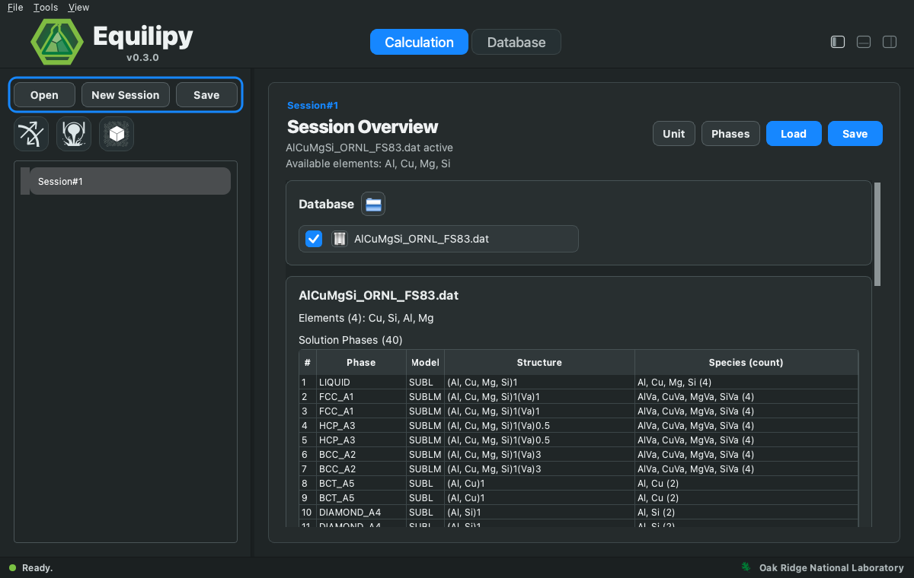
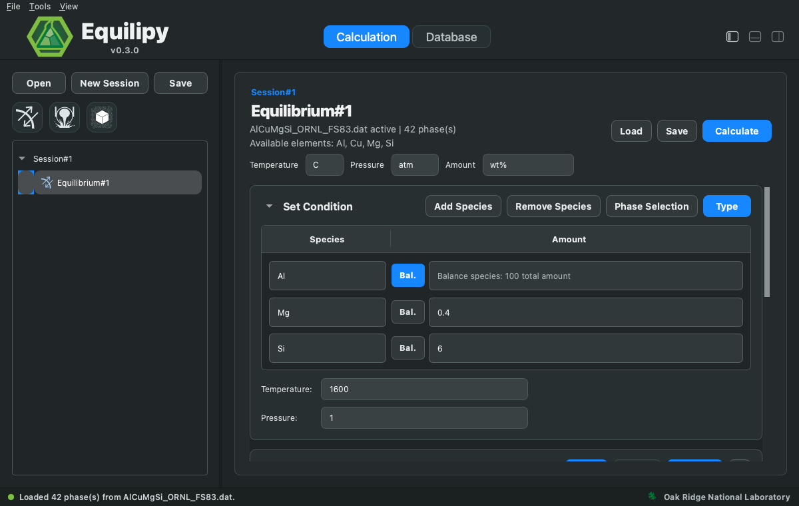
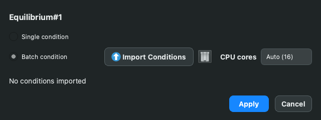
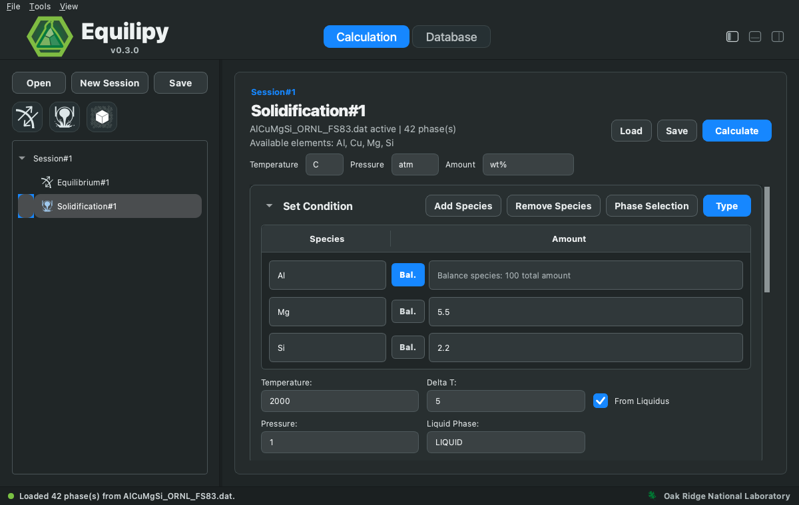
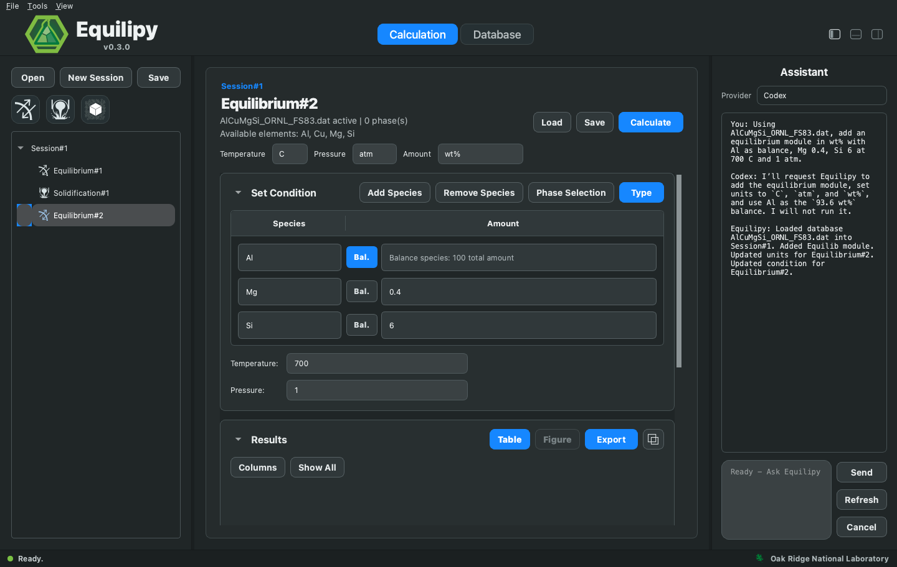

# Calculation

Work in the Calculation workspace is organized as:

```text
Active directory  ->  Session  ->  Module (Equilibrium / Solidification / ...)
```

1. **Open** — choose an active directory. Session files and the calculation
   log (`equilipy_gui_log.txt`) are stored there.
2. **New Session** — create a session, then attach one or more database
   files (`.dat`, `.tdb`) to it. Units for temperature, pressure,
   and amount are set per session.
3. Add a module with the module buttons in the sidebar, fill in the
   conditions, and press **Calculate** (or **Calculate All** for every
   module in the session).



Sessions and modules can be saved and reloaded (`Save`/`Load`), including
calculated results, so a session can be reopened later without recomputing.

## Equilibrium

Computes phase equilibrium for one condition or a batch:

- **Single**: enter the composition in the table and set temperature and
  pressure. Press **Bal.** next to a species to make it the balance of the
  total amount.

  

- **Batch**: press the **Type** button to open the calculation type
  dialog, select **Batch condition**, and import a condition table (CSV);
  each row is one NPT condition. Batch runs execute in parallel over the
  selected CPU cores.

  

Use **Phases** to restrict the calculation to a subset of phases
(metastable equilibria); the phase list is read from the attached database
for the entered elements.

## Solidification

Computes solidification paths on cooling. The calculation type dialog
selects:

- **Model**: classical Scheil-Gulliver, NucleoScheil (Scheil with
  nucleation-undercooling control per phase), or Equilib cooling
  (full equilibrium at each temperature step).
- **Mode**: single condition or batch.
- **ΔT** temperature step, the liquid phase name, and whether to start from
  the liquidus.



## Nucleation

Reserved for nucleation-specific calculations. **This module is not yet
available in the current release**; the NucleoScheil model under
Solidification covers nucleation-controlled solidification.

## AI-assist

The Assistant panel (toggled with the panel button at the top right) sets
up and runs calculations from plain-language requests. Pick a provider —
Local, or an installed CLI assistant such as Codex, Claude, or Gemini —
type what you want, and press **Send**.

The assistant drives the GUI through a fixed set of allowed actions
(create session, load database, add module, set units/conditions, select
phases, calculate). It reads the current GUI state first, and it never
starts a solver on its own: unless you explicitly ask it to run, it only
prepares the module so you can review the inputs and press **Calculate**
yourself.

The best results come from one request that states, in order:

1. **Database** — the exact file name (skip if the session's database is
   already active).
2. **Module** — equilibrium, or solidification with the model
   (Scheil-Gulliver, NucleoScheil, or Equilib cooling).
3. **Units** — the amount basis (`wt%`, moles, ...) and temperature scale.
4. **Composition and conditions** — amounts with a named balance species,
   plus temperature and pressure.
5. **Whether to run** — end with "and run it" to launch immediately.

For example:

> Using AlCuMgSi_ORNL_FS83.dat, add an equilibrium module in wt% with Al
> as balance, Mg 0.4, Si 6 at 700 C and 1 atm.

> Using AlCuMgSi_ORNL_FS83.dat, add a Scheil solidification module in
> wt%: Al balance, Mg 5.5, Si 2.2, starting from the liquidus with ΔT 5
> and liquid phase LIQUID.



Batch scans also work in plain language: "in wt% with Al as balance at
700 C, scan Mg 0 to 3 in 0.5 steps and Si 0 to 5 in 0.5 steps" fills the
batch grid of the selected module.

:::{note}
Always state the amount basis (`wt%` vs moles) — it is the most common
source of misread compositions — and name the database file explicitly
when the active directory contains more than one. The assistant reports
what Equilipy executed; it will not claim an action ran when it did not.
:::

## Results

Each module has a Results section:

- **Table** — calculated values per condition. **Columns** selects visible
  columns, **Show All** resets, **Export** writes CSV.
- **Figure** — plot any result column against another with configurable
  palette.
- **Detach (⧉)** — moves the Results panel into its own window, so results
  from several calculations can be arranged side by side across the screen.
  Close the window (or press the button again) to dock it back.

The Log panel at the bottom shows solver output; the same text is written
to `equilipy_gui_log.txt` in the active directory.
