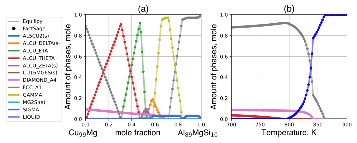
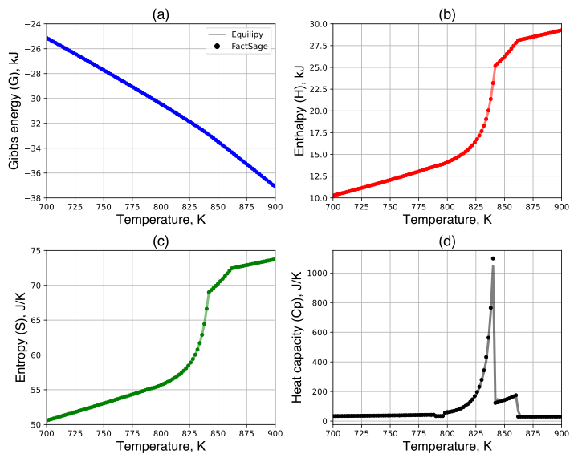
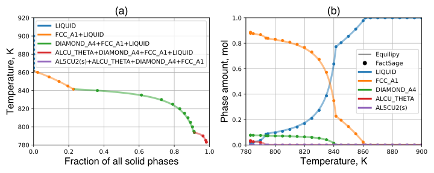
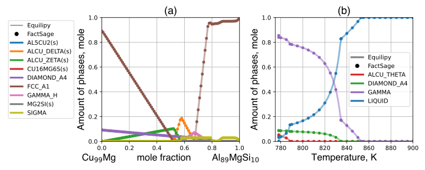

# Summary
The CALPHAD (CALculation of PHAse Diagram) approach [@CALPHAD:1998] provides predictions for thermodynamically stable phases in multicomponent-multiphase materials across a wide range of temperatures. Consequently, the CALPHAD calculations became an essential tool in materials and process design [@Luo:2015]. Such design tasks frequently require navigating a high-dimensional space due to multiple components involved in the system. This increasing complexity demands for high-throughput CALPHAD calculations, especially in the rapidly evolving field of alloy design.

In response to the need, we developed Equilipy an open-source Python package designed for calculating phase equilibria of multicomponent-multiphase systems. Equilipy is specifically tailored for high-throughput CALPHAD calculations, offering parallel computations across multiple processors and nodes with the given *NPT* input conditions namely elemental compositions (*N*), pressure (*P*), and temperature (*T*). Equilipy utilizes the program structure and Gibbs energy functions from the Fortran-based program, Thermochimica [@Thermochimica:2013], with incorporating a new Gibbs energy minimization algorithm. This algorithm, originally developed by Capitani and Brown in 1987 [@Capitani:1987], has been revised and implemented to enhance the stability and performance of calculations. The Fortran codes are precompiled and interfaced with Python via `F2PY`, ensuring high computation speed. Benchmark tests shown in \autoref{Fig1} demonstrate that Equilipy's computation speed is comparable to those of established commercial software, TC-Python and PanPython. This result highlights its efficiency and potential applications in various scientific and industrial fields.

{ width=98% }

# Statement of need
Commercial thermochemical software packages such as Thermo-Calc [@ThermoCalc:2002], FactSage [@FactSage:2016], and Pandat [@Pandat:2009] are the standard for phase equilibrium calculations. However, exploring a broad spectrum of alloy chemistries is often hindered by the considerable computational time required. Such computational demands create a bottleneck in effective alloy design processes. While efforts to leverage High-Performance Computing (HPC) have been initiated to expedite computational speed, these attempts are often limited by licensing constraints such as the number of processors available for use (e.g., TC-Python permits only up to 32 logical processors per each license).

Given these limitations and the pressing need for more effective alloy design processes, developing an open-source program tailored for high-throughput CALPHAD calculations becomes imperative. The envisioned program should not only eliminate the constraints on processor usage, but also ensure high calculation stability. Furthermore, the program should operates on Linux system and support parallel computing to be compatible with HPC environments. An intuitive program architecture is preferred to enhance accessibility for researchers and practitioners in the field.

# Software overview
Equilipy is designed to compute thermodynamically stable phases from a specified *NPT* ensemble (i.e., *N*: elemental composition, *P*: pressure, *T*: temperature). The four-step process for calculating phase equilibria is illustrated in \autoref{Fig2}. This process closely mirrors experimental procedures; thus, it is highly intuitive even for the users primarily experienced in experimental work. Calculating phase equilibria involves minimizing a set of Gibbs energy functions for all relevant phases. Therefore, utilizing Equilipy necessitates a Gibbs energy database developed through the CALPHAD approach.

{ width=95% }

# Features

Equilipy 0.1 incorporates several key features:

- Phase equilibrum calculation for a single *NPT* input condition,
- Parallel computations for multiple *NPT* input conditions,
- Thermochemical property calculations,
- Scheil-Gulliver solidification,
- Metastable phase stability calculations.

By default, phase equilibrium calculations consider all available phases within the given thermochemical database, corresponding to the input system elements. Consequently, we obtain thermodynamically stable phases, their respective quantities through equilibrium calculations, alongside pertinent thermochemical properties such as Gibbs energy (*G*), enthalpy (*H*), entropy (*S*), and heat capacity (*Cp*). The demonstration of such calculations is given in **Phase equilibria** section for multiphase equilibria. Moreover, we introduce the application of thermodynamic calculations for solidifications [@Scheil:1942] in **Scheil-Gulliver solidification**. Metastable phase stability calculations are possible with the phase selection option, as detailed in the step 2 of \autoref{Fig2}. This option enables the parsing of custom-selected phases within the relevant phase set for metastable calculations. Examples showcasing the phase selection feature in action, both for phase equilibrium calculation and Scheil-Gulliver solidification, are presented in **Metastable phase equilibria**.

## Phase equilibria
\autoref{Fig3} presents the phase equilibrium calculations of the Al-Cu-Mg-Si system. We conducted Gibbs energy minimization of 63 distinct phases to derive the stable phase assemblages and their respective quantities at each calculation point. These calculations were performed using `equilib_batch()` feature. The outcomes were then compared with results from a commercial thermochemical software, FactSage [@FactSage:2016], employing an identical thermodynamic database for both tools. \autoref{Fig3}(a) illustrates the stable phase quantities in a pseudo-binary section (isopleth) between Cu99Mg and Al89MgSi10 alloys at 600 K. Meanwhile, \autoref{Fig3}(b) shows the equilibrium calculations across various temperatures for the A380 alloy, with 89.260, 1.745, 0.114, and 8.881 at%, for Al, Cu, Mg, Si, respectively. The comparative analyses reveal that both programs consistently predicted the same stable phases and their quantities. It is worth noting that `equilib_batch()` feature processes each *NPT* condition independently, ensuring consistent computation speed and accuracy irrespective of the sequence or arrangement of the input conditions.

{ width=100% }

\autoref{Fig4} showcases the thermochemical properties of A380 alloy where the temperature range corresponds to the calculation depicted in \autoref{Fig3}(b). These properties represent the total properties of the system which is composed of four phases i.e., Liquid, FCC_A1, DIAMOND_A4, and ALCU_THETA. All three major properties, Gibbs energy, enthalpy, and entropy of the system calculated by FactSage [@FactSage:2016] are reproduced by Equilipy. This congruent result highlights Equilipy's ability to match the calculation precision of the established commercial software.

## Scheil-Gulliver solidification

Exploring Scheil-Gulliver solidification offers a robust framework for assessing the performance of phase equilibria calculations. In Scheil-Gulliver solidification, the liquid phase is assumed to remain completely mixed, while no diffusion or reaction is considered bewteen solid phases once they precipitate from the liquid. This approach effectively represents the characteristics of rapid and slow diffusion in the liquid and solid phases during solidification, respectively. A single Scheil-Gulliver cooling computation necessitates multiple equilibrium calculation iterations, i.e., one for each temperature step. This approach serves as a rigorous benchmark to assess the accuracy and stability of Equilipy in comparison with the well-established commercial software, FactSage [@FactSage:2016].

\autoref{Fig5} demonstrates the progression of microstructural information and phase quantities during Scheil-Gulliver solidification. The microstructural information is presented in \autoref{Fig5}(a), where each color represents a unique set of solidifying phases, termed a Scheil constituent [@Pelton:2017]. Initially, the FCC_A1 solid phase forms at 861 K and continues to solidify as a primary phase until it reaches a fraction of 20 mol%. Following this, the next Scheil constituent is a two-phase eutectic structure comprised of FCC_A1 and DIAMOND_A4 phases. This eutectic structure persists in solidifying until the temperature reduces to 793 K. At this juncture of solidification, over 90 mol% of the liquid has been consumed, followed by the formation of less than 10 mol% of complex three- and four-phase eutectic structures. \autoref{Fig5}(b) shows the respective quantity of each phase during Scheil-Gulliver solidification. Various rates of solidifying amount for a phase (e.g., FCC_A1) highlights that a phase can be involved in multiple Scheil constituents. As depicted in the figure, the fractions of Scheil constituents and respective phase quantities align closely with those calculated by FactSage, demonstrating the reliability and accuracy of the simulation results.

{ width=100% }

## Metastable phase equilibria

\autoref{Fig6} illustrates the metastable phase equilibrium calculations for both (a) equilibrium calculations and (b) Scheil-Gulliver solidification. For each case, a set of custom-selected phases was applied as outlined in step 2 of \autoref{Fig2}. The equilibrium calculations shown in \autoref{Fig6}(a) use the same input conditions as those in \autoref{Fig3}(a), but with the suppression of the GAMMA, ALCU_ETA, and ALCU_THETA phases. Similarly, the conditions for Scheil-Gulliver solidification shown in \autoref{Fig5}(b) are replicated in \autoref{Fig6}(b) without taking into account the FCC_A1 phase. This approach to calculate metastable phase equilibria is also available in FactSage. As shown in \autoref{Fig6}, the results obtained from both Equilipy and FactSage are remarkably consistent for the calculations of metastable phase equilibria.

{ width=100% }

# Parallel computing
Equilipy leverages parallel computing to calculate multiple input conditions simultaneously through its `equilib_batch()` function. Since computations between input conditions are fully independent, they are executed through embarrassingly parallel runs. Note that parallel computing is not applied to compute a single input condition. By default, Equilipy uses all available processors on a single computing node, though users have the option to specify a different number of processors. In multi-node environments, users are required to configure the number of nodes and processors using a Message Passing Interface (MPI) such as `OpenMPI` or `MPICH`. Equilipy employs `mpi4py` for interfacing with MPI programs.

# Related programs
**Table 1** presents a compilation of both commercial and non-commercial programs similar to Equilipy, designed for computing multicomponent-multiphase equilibria. Broadly, these programs split into two categories: those employing the CALPHAD approach, and those designed for geological applications. While both approaches share the same fundamental principle of using Gibbs energies as the building blocks of thermochemical properties, assessed from experimental data, their primary distinction lies in their free energy model descriptions.

**Table 1** List of commercial and non-commercial programs for multicomponent-multiphase equilibrium calculations.\label{Table1}

+-----------------------------------------------------------------+------------------------------------+-----------------------------------------------------------------------------+
| Name                                                            | Type                               | Reference                                                                   |
+:================================================================+:===================================+:============================================================================+
| ‡[FactSage/ChemApp](https:factsage.com/)                        | Commercial                         | [@FactSage:2016]                                                            |
+-----------------------------------------------------------------+------------------------------------+-----------------------------------------------------------------------------+
| ‡[Thermo-Calc/TC-Python](https:thermocalc.com/)                 | Commercial                         | [@ThermoCalc:2002]                                                          |
+-----------------------------------------------------------------+------------------------------------+-----------------------------------------------------------------------------+
| ‡[Pandat/PanPython](https:computherm.com/)                      | Commercial                         | [@Pandat:2009]                                                              |
+-----------------------------------------------------------------+------------------------------------+-----------------------------------------------------------------------------+
| ‡[JMatPro](https:matplus.eu/)                                   | Commercial                         | [@JMatPro:2003]                                                             |
+-----------------------------------------------------------------+------------------------------------+-----------------------------------------------------------------------------+
| ‡[ThermoSuite](https:thermosuite.com)                           | Commercial                         | [@Thermosuite:2002]                                                         |
+-----------------------------------------------------------------+------------------------------------+-----------------------------------------------------------------------------+
| ‡[MALT](https:kagaku.com/malt)                                  | Commercial                         | [@MALT:2002]                                                                |
+-----------------------------------------------------------------+------------------------------------+-----------------------------------------------------------------------------+
| ‡[MTData](https:www.phase-trans.msm.cam.ac.uk/mtdata/index.html)| Non-commercial                     | [@MTDATA:2002]                                                              |
+-----------------------------------------------------------------+------------------------------------+-----------------------------------------------------------------------------+
| ‡[OpenCalphad](https:opencalphad.com)                           | Non-commercial                     | [@OC:2015]                                                                  |
+-----------------------------------------------------------------+------------------------------------+-----------------------------------------------------------------------------+
| ‡[PyCalphad](https:pycalphad.org)                               | Non-commercial                     | [@PyCALPHAD:2017]                                                           |
+-----------------------------------------------------------------+------------------------------------+-----------------------------------------------------------------------------+
| ‡[Thermochimica](https:github.com/ORNL-CEES/thermochimica)      | Non-commercial                     | [@Thermochimica:2013]                                                       |
+-----------------------------------------------------------------+------------------------------------+-----------------------------------------------------------------------------+
| *[THERMOCALC](https:hpxeosandthermocalc.org/)                   | Non-commercial                     | [@THERMOCALC:1988]                                                          |
+-----------------------------------------------------------------+------------------------------------+-----------------------------------------------------------------------------+
| [Theriak-Domino](https:github.com/Theriak-Domino/theriak-domino)| Non-commercial                     | [@Theriak:2010]                                                             |
+-----------------------------------------------------------------+------------------------------------+-----------------------------------------------------------------------------+
| [Perple_X](https:perplex.ethz.ch)                               | Non-commercial                     | [@Perple_X:2005]                                                            |
+-----------------------------------------------------------------+------------------------------------+-----------------------------------------------------------------------------+
| [GeoPS](http:geops.org)                                         | Non-commercial                     | [@GeoPS:2022]                                                               |
+-----------------------------------------------------------------+------------------------------------+-----------------------------------------------------------------------------+
| [MAGEMin](https:computationalthermodynamics.github.io/MAGEMin)  | Non-commercial                     | [@MAGEMin:2022]                                                             |
+-----------------------------------------------------------------+------------------------------------+-----------------------------------------------------------------------------+
| [HeFESTo](https:sites.epss.ucla.edu/lithgow-bertelloni/hefesto) | Non-commercial                     | [@HeFESTo:2011]                                                             |
+=================================================================+====================================+=============================================================================+
| ‡Software that use the CALPHAD approach for free energy descriptions .                                                                                                             |
| *THERMOCALC calculates the composition of a given phase assemblage ; however, it does not ensure if the given assemblage is thermodynamically stable [@Lanari:2019].               |
+=================================================================+====================================+=============================================================================+

For geological applications, the gibbs energies of non-ideal solution phases are described by Margules parameters as a function of composition, pressure, and temperature. In contrast, the CALPHAD approach focuses on structure-based Gibbs energy descriptions at 1 atm pressure using solution models such as the compound energy formalism (CEF) for long-range ordering and the modified quasichemical models for short-range ordering. These variations in free energy descriptions are well-documented in the literature for the CALPHAD approach [@CALPHAD:1998] and for geological applications [@Holland:2011].

Note that there is no general consensus on a thermochemical database format. Each software often has its own format. The database format used in Equilipy (`.dat`) is compatable in FactSage [@FactSage:2016], PyCalphad [@PyCALPHAD:2017], and Thermochimica [@Thermochimica:2013].

# Limitation and future plan
The current version of Equilipy (0.1.4) is specifically designed for metallic systems and currently lacks the capability to handle calculations for systems composed of non-elemental species, such as oxides, sulfides, carbides, nitrides, etc. Integration of these calculations with non-elemental species is planned for the upcoming version. Additionally, the existing thermochemical database parser in Equilipy is compatible only with the older ChemSage data format `.dat`, available from FactSage 7.3. It's important to note that Equilipy does not support the newer ChemSage `.dat` data format introduced in FactSage 8.0 or later, nor the `.tdb` data format used by Thermo-Calc and Pandat. Enhancements to incorporate parsers for these newer database structures are also planned for the next release of Equilipy.

# Acknowledgements

The development of Equilipy was sponsored by the U.S. Department of Energy (DOE), Office of Energy Efficiency and Renewable Energy (EERE), Office of Sustainable Transportation, Vehicle Technologies Office (VTO). This manuscript has been authored by UT-Battelle, LLC under Contract No. DE-AC05-00OR22725 with the U.S. Department of Energy. The United States Government retains and the publisher, by accepting the article for publication, acknowledges that the United States Government retains a non-exclusive, paid-up, irrevocable, world-wide license to publish or reproduce the published form of this manuscript, or allow others to do so, for United States Government purposes. The Department of Energy will provide public access to these results of federally sponsored research in accordance with the DOE Public Access Plan (http://energy.gov/downloads/doe-public-access-plan). The authors extend their gratitude to In-Ho Jung and Jaesung Lee from the Department of Materials Science and Engineering at Seoul National University for their valuable discussions on algorithms. Special thanks are also due to Samuel T. Reeve and Gerald L. Knapp for their technical support and insightful discussion concerning programming.

# References

<!-- # equations
Single dollars ($) are required for inline mathematics e.g. $f(x) = e^{\pi/x}$

Double dollars make self-standing equations:

$$\Theta(x) = \left\{\begin{array}{l}
0\textrm{ if } x < 0\cr
1\textrm{ else}
\end{array}\right.$$

You can also use plain \LaTeX for equations
\begin{equation}\label{eq:fourier}
\hat f(\omega) = \int_{-\infty}^{\infty} f(x) e^{i\omega x} dx
\end{equation}
and refer to \autoref{eq:fourier} from text.

# Citations

Citations to entries in paper.bib should be in
[rMarkdown](http://rmarkdown.rstudio.com/authoring_bibliographies_and_citations.html)
format.

If you want to cite a software repository URL (e.g. something on GitHub without a preferred
citation) then you can do it with the example BibTeX entry below for @fidgit.

For a quick reference, the following citation commands can be used:
- `@author:2001`  ->  "Author et al. (2001)"
- [@author:2001] -> "(Author et al., 2001)"
- [@author1:2001; @author2:2001] -> "(Author1 et al., 2001; Author2 et al., 2002)"

# Tables

+-------------------+------------+----------+----------+
| Header 1          | Header 2   | Header 3 | Header 4 |
|                   |            |          |          |
+:=================:+:==========:+:========:+:========:+
| row 1, column 1   | column 2   | column 3 | column 4 |
+-------------------+------------+----------+----------+
| row 2             | cells span columns               |
+-------------------+------------+---------------------+
| row 3             | cells      | - body              |
+-------------------+ span rows  | - elements          |
| row 4             |            | - here              |
+===================+============+=====================+
| Footer                                               |
+===================+============+=====================+

# Figures

Figures can be included like this:

and referenced from text using \autoref{fig:example}.

Figure sizes can be customized by adding an optional second parameter:
{ width=20% } -->

